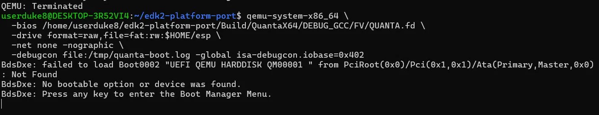
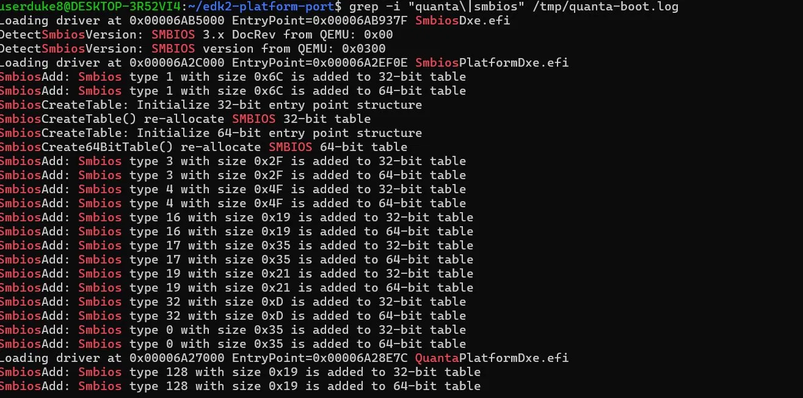
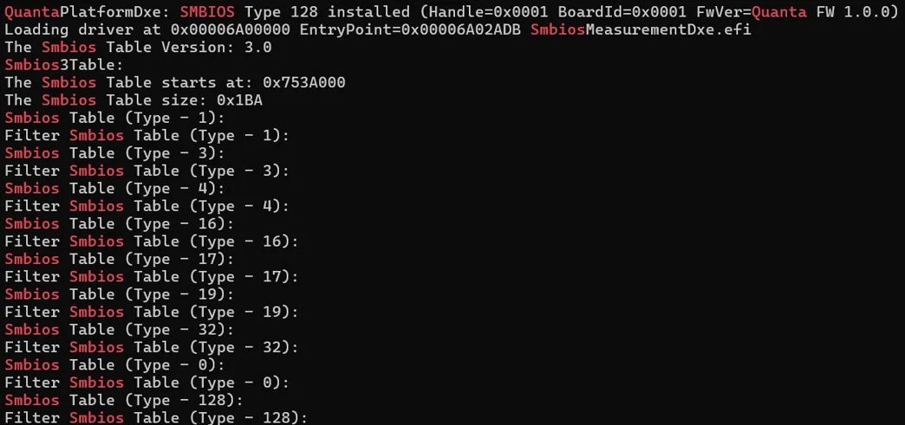
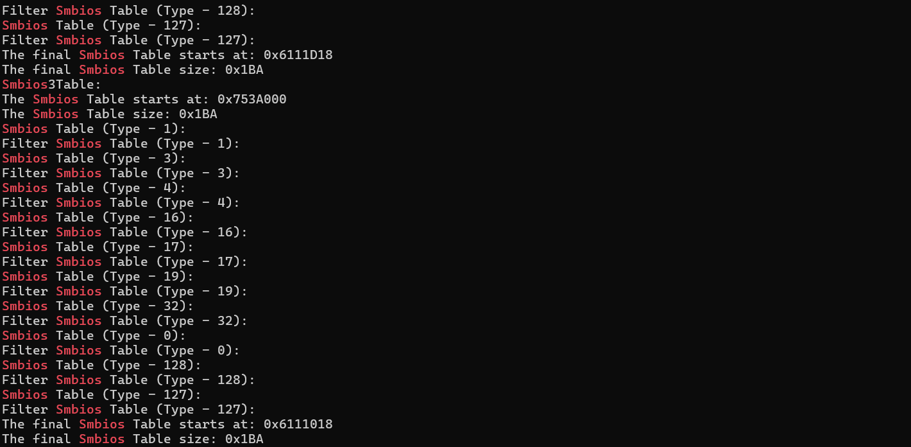

# edk2-platform-port

EDK2 platform porting example — Quanta Platform Package (`QuantaPkg`).

Forks `OvmfPkgX64` and adds:

| Feature | Location |
|---------|----------|
| `QuantaPlatformDxe` DXE driver | `QuantaPkg/QuantaPlatformDxe/` |
| Custom PCDs (`PcdQuantaBoardId`, `PcdQuantaFirmwareVersionString`) | `QuantaPkg/QuantaPkg.dec` |
| SMBIOS Type 128 OEM record | `QuantaPlatformDxe.c` → `InstallSmbiosType128()` |

## Directory layout

```
edk2-platform-port/
├── build.sh                              # one-shot build helper
└── QuantaPkg/
    ├── QuantaPkg.dec                     # package declaration + custom PCDs
    ├── QuantaPkgX64.dsc                  # platform DSC (based on OvmfPkgX64)
    ├── QuantaPkgX64.fdf                  # flash layout (based on OvmfPkgX64)
    └── QuantaPlatformDxe/
        ├── QuantaPlatformDxe.inf
        └── QuantaPlatformDxe.c
```

## Prerequisites

- EDK2 source tree at `~/edk2-port` (or set `$EDK2_DIR`)
- GCC 5 / GCC 12 toolchain
- `nasm`, `python3`, `iasl`

```bash
# Ubuntu / Debian
sudo apt install build-essential nasm python3 acpica-tools uuid-dev
```

## Build

```bash
cd ~/edk2-platform-port
./build.sh DEBUG          # or RELEASE / NOOPT
```

The script sets `PACKAGES_PATH` so EDK2 resolves both `OvmfPkg` (from EDK2) and `QuantaPkg` (from this repo) automatically.

Output firmware images land in `~/edk2-port/Build/QuantaX64/DEBUG_GCC5/FV/`.

## Custom PCDs

| PCD | Default | Description |
|-----|---------|-------------|
| `gQuantaPkgTokenSpaceGuid.PcdQuantaBoardId` | `0x0001` | 16-bit board identifier |
| `gQuantaPkgTokenSpaceGuid.PcdQuantaFirmwareVersionString` | `L"Quanta FW 1.0.0"` | FW version embedded in SMBIOS Type 128 |

Override at build time:

```bash
build -p QuantaPkg/QuantaPkgX64.dsc -a X64 -t GCC5 \
      -D PcdQuantaBoardId=0x0042
```

## SMBIOS Type 128 record

`QuantaPlatformDxe` locates `EFI_SMBIOS_PROTOCOL` and installs one OEM record:

```
Type   : 128 (0x80)
Length : 8 bytes (fixed part)
Offset 4: BoardId (UINT16)  ← PcdQuantaBoardId
Offset 6: StringIndex = 1  → "Quanta FW 1.0.0"
Offset 7: Reserved = 0
String table: "<PcdQuantaFirmwareVersionString>\0\0"
```

Verify after boot with `dmidecode -t 128` (Linux guest) or `smbiosview -t 128` (UEFI Shell).

## End-to-end verification

### 1. Quanta firmware artifacts built


### 2. DXE phase: drivers dispatched in order
Standard SMBIOS DXE driver registers types 1/3/4/16/17/19/32/0 first,
then **QuantaPlatformDxe** loads and registers **Type 128** to both
32-bit and 64-bit tables (SMBIOS 3.x dual-table requirement).



### 3. OEM SMBIOS Type 128 installed
Handle assigned by `EFI_SMBIOS_PROTOCOL`, with `BoardId` and `FwVer`
populated from the OEM PCD declarations.



### 4. Final SMBIOS table integrity
`SmbiosMeasurementDxe` walks the published table and confirms **Type 128
sits before Type 127 (end-of-table)** — proving the OEM record is fully
integrated and OS-visible.


